# Programming_and_Scripting_Project_2020

## Problem statement 
This project concerns the well-known Fisher’s Iris data set. You must research
the data set and write documentation and code (in Python) to investigate it. An
online search for information on the data set will convince you that many people have
investigated it previously.

You are expected to be able to break this project into several smaller tasks that are
easier to solve, and to plug these together after they have been completed. You might
do that for this project as follows:

1. Research the data set online and write a summary about it in your README.
2. Download the data set and add it to your repository.
3. Write a program called analysis.py that:

    * outputs a summary of each variable to a single text file,
    * saves a histogram of each variable to png files
    * outputs a scatter plot of each pair of variables.

It might help to suppose that your manager has asked you to investigate the data
set, with a view to explaining it to your colleagues. Imagine that you are to give a
presentation on the data set in a few weeks’ time, where you explain what investigating
a data set entails and how Python can be used to do it. You have not been asked to
create a deck of presentation slides, but rather to present your code and its output to
them.

## *Introduction*
In 1936, the british biologist and statistician Ronald Fisher published “The use of multiple measurements in taxonomic problems”. In this paper Fisher states that “when two or more poplualtions have been measured in several characters special interest attaches to certain linear functions of the measurements by which the populations are discriminated”. This is known as linear discriminant analysis (LDA).

## *Anderson's IRIS Data Set*
To demonstrate LDA Fisher used data that was collected by the American botanist Edgar Anderson. The data was collected for three related species of IRIS flower; setosa, virginica and versicolor depicted in Figure 1. In total data was collected for 50 samples of each of the three species, a total of 150 samples. For each of the samples four variables were measured;
1. Sepal Length
2. Sepal Width
3. Petal Length
4. Petal Width

||
| :--: |
| *Figure 1: species of IRIS flower* |

### Checking the Data Set
Dataset obtained from:
https://gist.githubusercontent.com/curran/a08a1080b88344b0c8a7/raw/639388c2cbc2120a14dcf466e85730eb8be498bb/iris.csv

The first step is to do some simple checks on the data and compare that with what we know. There are four measurements per sample and 50 samples of each of the three species. The first step is to run a simple script to check that the data set obtained meets this criteria.

||
| :--: |
| *Figure 2 input code* |

*Explaining the code*

Import pandas, then set up a dataframe from the .csv file. In this data set there is a column called "count" included. This column is required later for univariate analysis. However for this part of the analysis, this column is to be ignored. To understand how to ignore the column some research was required and the solution was found here: 

https://stackoverflow.com/questions/29763620/how-to-select-all-columns-except-one-column-in-pandas

 The first section of the code checks that the correct columns are there and the number of rows and columns are as expected. The last section of code is to check if there are 50 of each species as expected.

| 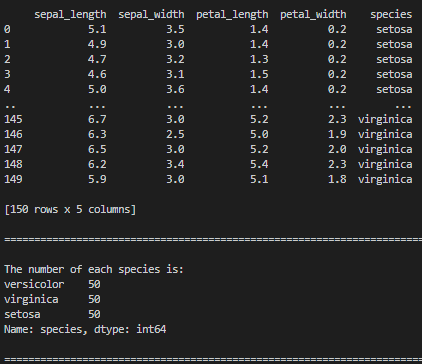|
| :--: |
| *Figure 3 output* |

With reference to Figure 3 it can be seen that there are 5 columns and 150 rows. There are also 50 of each species included in the data set. The data set meest the criteria.

### *Data summary*

The next step is to output a summary of each variable to a single text file. The text file is named "summary_of_variables" and is saved in the same directory as the analyis.py file. See Figure 4 for the code to complete this part of the project. A second dataframe was set up to ignore the "Count" column. There is also a snip of the text file provided in Figure 5.

https://stackoverflow.com/questions/11285613/selecting-multiple-columns-in-a-pandas-dataframe

https://www.w3resource.com/pandas/dataframe/dataframe-to_string.php

| 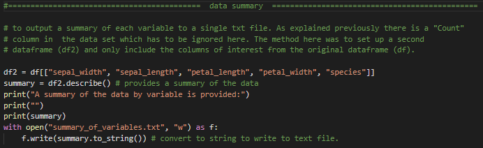|
| :--: |
| *Figure 4 data summary code* |

| |
| :--: |
| *Figure 5 data summary result* |

### Data Set Analysis
The first step is checking if the data follows a normal distribution. This test was compete using the Shapiro-Wilk normality test  considered the most powerful test when testing for a normal distribution.

https://towardsdatascience.com/6-ways-to-test-for-a-normal-distribution-which-one-to-use-9dcf47d8fa93.

Refer to Figure 6 for the code used to check normality.

| |
| :--: |
| *Figure 6 normality test in* |

Refer to Figure 7 for the result of the normality test.
| 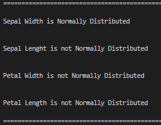|
| :--: |
| *Figure 7 normality test results* |

With reference to Figure 7 it can be seen that Sepal Width is the only variable that follows a normal distribution.

### Individual Variable (Univariate) Analysis

Having assessed the data for normality, the next step in the analysis is to look at univariate analysis. For this analysis a histogram, boxplot and a single variable scatter plot for each of the four variables (petal length, petal width, sepal length and sepal with) is provided. Refer to Figure 8 for the code used to plot the histograms.

*Important to note that the same code is repeated for the four variables, therefor only the code for the first plot is included here. This trend is applied throughout this README.*

https://realpython.com/python-histograms/

| 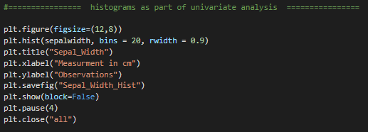|
| :--: |
| *Figure 8 histogram code* |

The code in Figure 8 saves the files in the same folder as the analysis.py file. Figure 9 is included for reference where all histograms are included in a single .png file. A point of interest here is that through the Shapiro-Wilk normality test previously, Sepal Width was the only variable which followed a normal distribution. With reference to Figure 9 Sepal width histogram also looks the most "normal".

| 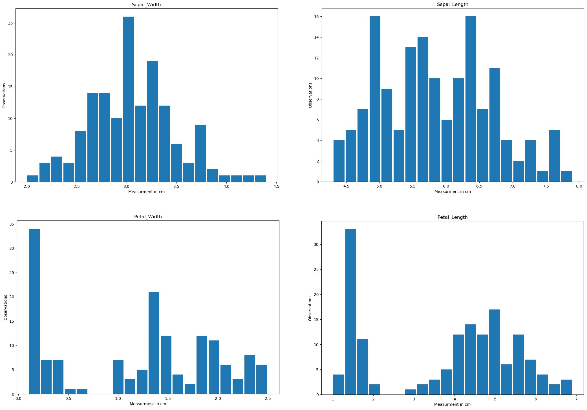|
| :--: |
| *Figure 9 histograms for all individual variables* |

The next univariate plot is the boxplot, refer to Figure 10 for the code used to plot the boxplots.

https://seaborn.pydata.org/generated/seaborn.boxplot.html

| |
| :--: |
| *Figure 10 boxplot code* |

The code in Figure 10 saves the files in the same folder as the analysis.py file. Figure 11 is included in this README for reference where all boxplots are included in a single PNG file.

| |
| :--: |
| *Figure 11 boxplots for all individual variables* |

What's interesting in Figure 11 is that looking at sepal width and sepal length it would be difficult to seperate the three species as there is lot of overlap. However with reference to petal wdth and petal length it can be clearly seen that the setosa has a smaller petal in both the lenght and width dimensions.

The next univariate plot is a scatter plot, refer to Figure 12 for the code used to plot the scatter plots. It may seem counter intuitive that only one variable of interest is being plotted on the scatter plot as they are typically used to understand relationships between two variables. However as an excercise it has been decided to include a column in the data set called "Count" and use this as a second variable to plot the variable of interest against (two variables are required to plot a scatter plot, one on the x-axis and one on the y-axis, for this exercise "Count" is used on the x-axis).

Another important point is that to do this the three species had to be individually defined, this can be seen in the first part of the code in Figure 12. The thought process here was to seperate each into their own dataframe, then define the four variables of each species.

https://stackoverflow.com/questions/24768657/replace-column-values-based-on-another-dataframe-python-pandas-better-way

In the boxplot code from Figure 10 it was possible to seperate the species by plotting the species on the x-axis, later in this README "hue" is used as part of the Seaborn pairplot to seperate the species. It's interesting to research different methods to seperate the species into their individual groups for analysis. One thing about programming that has become apparent is there are always many ways to solve every problem.

| 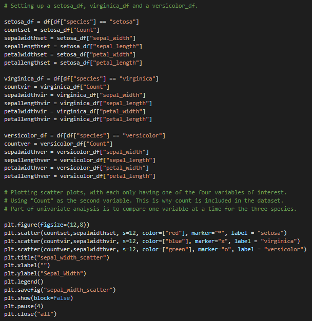|
| :--: |
| *Figure 12 scatter plot code with one variable of interest* |

The code in Figure 12 is only for sepal width, and is for reference. In the analysis.py file this code is repeated for all variables. Figure 13 includes all four boxplots in the same .png file.

| 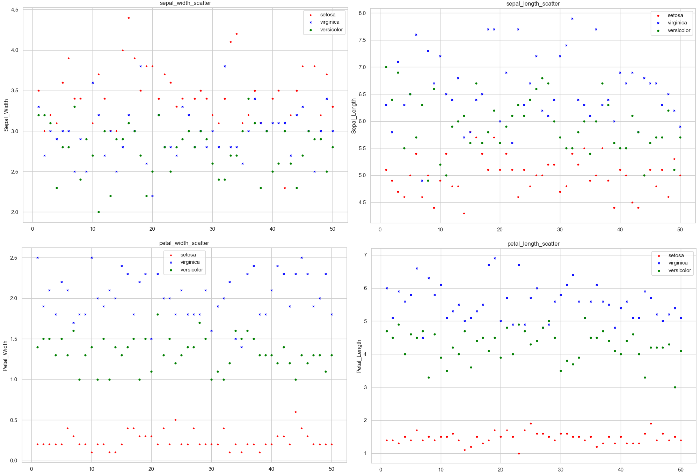|
| :--: |
| *Figure 13 scatter plots showing one variable of interest for all variables* |

With reference to Figure 13 it's interesting to see that when looking at sepal width and sepal length it would be difficult to seperate the three species as there is lot of overlap, however with reference to petal wdth and petal length it can be clearly seen that the setosa has a smaller petal in both the lenght and width dimensions.

This is of no surprise as this observation was also made when the boxplots were presented. It's interesting to see the different ways of presenting data and telling the same story through different methods.

### Multivariable Analysis
Multivariate analysis is where more than one variable is considered for a single outcome. It is relevant in the analysis of the IRIS data set as there are four variables for each species. In the univariate analysis it was determined that it wasn't possible to seperate the three species. The best univariate analysis resulted in two clusters of data where setosa was seperated based on petal size. It was not possible to seperate virginica and versicolor. With multivariate analysis the objective is to determine if the cluster containing virginica and versicolor can be seperated by species.

Using scatter plots two varibles are considered and plotted, the objective is to identify the different species of IRIS flower. As an learning excercise each of the pair of variables were plotted on a scatter plot and saved as individual .png files refer to Figure 14 for code.

The Seaborn pairplot code was also executed which plots all possible pairs of variables on scatter plots, seperated by the species through the hue feature. Refer to Figure 15 for Seaborn pairplot code. This section of code shows how efficient or unefficient a program can be. When programming unefficiently it took 12 lines of code per plot and 12 plots, a total of 144 lines of code, for the Seaborn pairplot 5 lines of code was all that was needed 3.4% of the original code. Refer to Figure 16 for Seaborn pairplot.

| 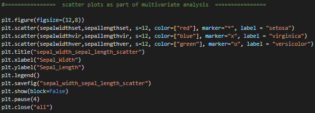|
| :--: |
| *Figure 14 scatter plot code, important to note that this code was repeated 12 times* |

https://seaborn.pydata.org/generated/seaborn.pairplot.html

| 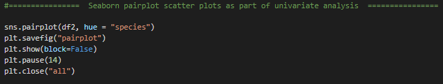 |
| :--: |
| *Figure 15 scatter plot code using Seaborn pairplot* |

| 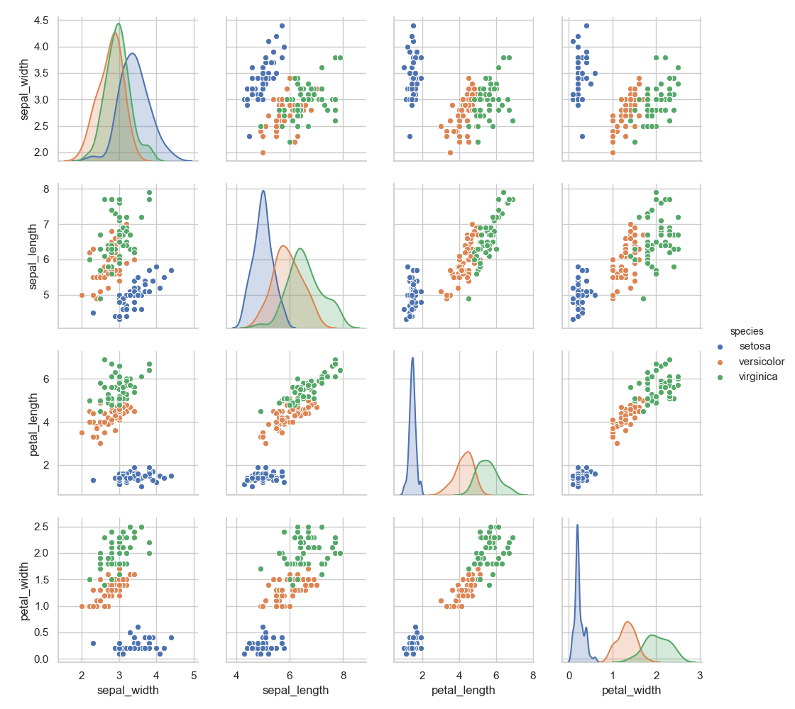|
| :--: |
| *Figure 16 Seaborn pairplot output* |

With reference to Figure 16 the advantage of multivariate analysis is highlighted. The obvious observation which we have already proven through univariate analysis is the two clusters of data. One cluster being the setosa, easily seperable based on petal size. The advantage with multivariate is that the second cluster of versicolor and virginica are much more seperable. There is some overlap between the species but much less than what was observed through univariate analysis. Consider petal length *vs.* petal width the three clusters can almost be seperated into setosa at bottom left, versiclor in the centre and virginica in the top right of the plot.

### Linear Discriminant Analysis (LDA) - Discussion
Having proven the advantage of multivariate analysis using two variables to seperate the species. Would it be an advantage if we could plot all four variables for each of the species. It would be ideal if we could plot all four variables, however it's not possible to draw a four dimensional graph. Could all four dimensions be represented on a two dimensioal graph? The answer is yes by using LDA.

Linear Discriminant Analysis (LDA) is a technique used to reduce the number of dimensions. In the IRIS data set it's possible to reduce the four variables to two dimensions. The objective of LDA is to maximise the seperability between groups. LDA projects the data onto a new axis in a way to maximise the seperation of the groups. The new axis is created according to two criteria considered simultaneously. Firstly maximise the distance between the means, secondly minimise the variation within each group.

https://www.youtube.com/watch?v=azXCzI57Yfc&t=509s

Although LDA is not included in the code, it was researched as part of the project and so it was felt worthwhile to include the explanation above and also the result of running LDA through pyton, the result of which is presented in Figure 17.

| 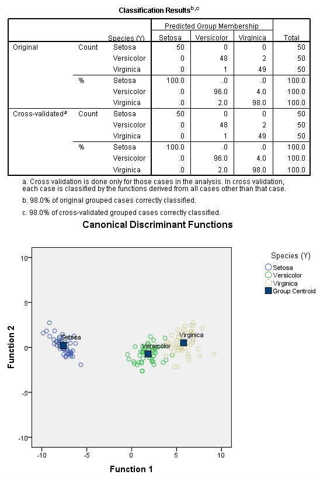|
| :--: |
| *Figure 17 linear discriminant analysis* |

With reference to Figure 17 it can be seen that through LDA reduced the four variables down to two dimensions; Function 1 and Function 2. Through LDA the species have better seperation than when two variables were considered earlier. It's interesting to note also that when cross validated, there were only three misclassifications between versicolor and virginica.

https://rpubs.com/pranaugi011089/98288

## Summary
The Iris data set was researched. Some analysis was carried out to ensure the data set was correct. This analysis included checking that the five variables and 150 rows were in the dataset. As part of the initial analysis it was confirmed that 50 of each species were within the dataset. All variables were analysed to check if they followed a normal distribution (Shapiro-Wilk). To finish off the initial analysis there was an output summary of each variable saved to a single text file. This summary included count, mean, std dev and some quartile information.

A column called "Count" was included in the dataset, this was included as some single variable scatter plots were required as part of the univariate analysis. Including count proved to be more awkward at times because when doing the initial analysis count had to be ignored, this took time to research and understand. Then later in the analysis there was arequirement to send a summary of the data to a text file. To overcome this a second dataframe was set up called df2 where the count column was not pulled into the second data frame. At the end of the programme the Seaborn pairplot was included, when using the original dataframe "Count" was included in the pairplot but it wasn't required. By using df2 the pairplot worked perfectly. Loads of learning around dataframes and how to manipulate them was achieved here.  

Next some univariate analyses was conducted, this included analysis using histograms, boxplots, and single variable scatter plots. From the univariate analysis it was possible to seperate the data into two clusters. It wasn't possible to seperate versicolor and virginica with any degree of confidence.

Finally multivariate analysis was complete using scatter plots.It was possible to seperate the three species to some degree but there was always a level of overlap bewteen versicolor and virginica, albeit much less than the overlap observed through univariate analysis.  

Finally a discussion around linear discriminant analysis (LDA) is included. Through LDA it was possible to seperate the three species with a high degree of confidence. Of the 100 data points between versicolor and virginica there were only three misclassifications.

## Conclusion
Enjoyed the challenge, one of the key learnings from this project is that there's always multiple ways to write a program for a desired outcome. It was interesting learning how to read in the dataframe from the CSV file and to pull the data and plot as required. It was also interesting to manipulate the dataframe to ignore certain columns or create new data frames that include desired columns from original dataframe.

Good learnings obtained when proving how difficult it was to seperate the species of Iris when using univariate analysis, but with multivariate analysis the seperability was greatly improved to the point that through LDA there were only 3 misclassifications from 150 data points.

Another interesting learning was that when plotting the scatter plots it took 144 lines of code to plot all variables but by using Seaborn paiplot it only required 6 lines of code for the same outcome.

When reviewing the finished code there are loads of ways to improve it but leaving it the way it is highlights the long winded approach that was taken to achieve some of the outcomes. With improvement in knowledge these outcomes could be achieved more efficiently now but that's what learning is all about.

I have spent many hours on this project, at times pulling my hair out but mostly enjoying the challenge. Programming was completely new to me, I had never written a single line of code in my life but after completing this project I feel that I have acquired a solid programming foundation on which to build.
