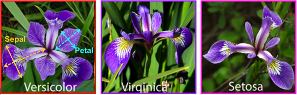

# Programming_and_Scripting_Project_2020

## Problem statement 
This project concerns the well-known Fisher’s Iris data set. You must research
the data set and write documentation and code (in Python) to investigate it. An
online search for information on the data set will convince you that many people have
investigated it previously.

You are expected to be able to break this project into several smaller tasks that are
easier to solve, and to plug these together after they have been completed. You might
do that for this project as follows:

1. Research the data set online and write a summary about it in your README.
2. Download the data set and add it to your repository.
3. Write a program called analysis.py that:

    * outputs a summary of each variable to a single text file,
    * saves a histogram of each variable to png files
    * outputs a scatter plot of each pair of variables.

It might help to suppose that your manager has asked you to investigate the data
set, with a view to explaining it to your colleagues. Imagine that you are to give a
presentation on the data set in a few weeks’ time, where you explain what investigating
a data set entails and how Python can be used to do it. You have not been asked to
create a deck of presentation slides, but rather to present your code and its output to
them.

## *Introduction*
In 1936, the british biologist and statistician Ronald Fisher published “The use of multiple measurements in taxonomic problems”. In this paper Fisher states that “when two or more poplualtions have been measured in several characters special interest attaches to certain linear functions of the measurements by which the populations are discriminated”. This is known as linear discriminant analysis (LDA). LDA is discussed in this README file in section X. The ai

## *Anderson's IRIS Data Set*
To demonstrate LDA Fisher used data that was collected by the American botanist Edgar Anderson. The data was collected for three related species of IRIS flower; setosa, virginica and versicolor depicted in Figure 1. In total data was collected for 50 samples of each of the three species, a total of 150 samples. For each of the samples four variables were measured;
1. Sepal Length
2. Sepal Width
3. Petal Length
4. Petal Width

||
| :--: |
| *Figure 1: species of IRIS flower* |

### Checking the Data Set
Dataset obtained from https://gist.githubusercontent.com/curran/a08a1080b88344b0c8a7/raw/639388c2cbc2120a14dcf466e85730eb8be498bb/iris.csv

The first step is to do some simple checks on the data and compare that with what we know. What we do know is that there are four measurements per sample, there are 50 of each of the three species so the first step is to run a simple script to check that the data set obtained is acceptable. The following code was executed.

||
| :--: |
| *Figure 2 input code* |

Explaining the code

Import pandas, then set up a dataframe from the .csv file. In this data set there is a column called "count"included. This column is required later when doing univariate analysis. However for this part of the analysis, this column is to be ignored. To understand how to ignore the column some research was required and the solution was found here: https://stackoverflow.com/questions/29763620/how-to-select-all-columns-except-one-column-in-pandas

 The first section of the code will check that the correct columns are there and the number of rows and colums are as expected. The last section of code is to check  if there are 50 of each species as expected.

| |
| :--: |
| *Figure 3 output* |

With reference to Figure 3 the data set looks acceptable. It can be seen that there are 5 columns and 150 rows. There are also 50 of each species included in the data set.

### Data Set Analysis
The first step is checking if the data follows a normal distribution. This test was compete using the Shapiro-Wilk normality test  considered the most powerful test when testing for a normal distribution https://towardsdatascience.com/6-ways-to-test-for-a-normal-distribution-which-one-to-use-9dcf47d8fa93.

Refer to Figure 4 for the code used to check normality.

| |
| :--: |
| *Figure 4 normality test in* |

Refer to Figure 5 for the result of the normality test.
| |
| :--: |
| *Figure 5 normality test results* |

With reference to Figure 4 it can be seen that Sepal Width is the only variable that follows a normal distribution.

### Individual Variable (Univariate) Analysis

Having assessed the data for normality, the next step in the analysis is to look at univariate analysis. For this analysis a histogram, boxplot and a single variable scatter plot for each variable of the four variables (petal length, petal width, sepal length and sepal with) will be provided.

Refer to Figure 6 for the code used to plot the histograms.
| |
| :--: |
| *Figure 6 histogram code* |

The code in Figure 6 saves the files in the same folder as the analysis.py file. Figure 7 is included in this README for reference where all histograms are included in a single PNG file. A point of interest here is that through the Shapiro-Wilk normality test previously, Sepal Width was the only variable which followed a normal distribution. With reference to Figure 7 Sepal width histogram also looks the most "normal".

| |
| :--: |
| *Figure 7 histograms for all individual variables* |

The next univariate plot is the boxplot, refer to Figure 8 for the code used to plot the boxplots.
| |
| :--: |
| *Figure 8 boxplot code* |

The code in Figure 8 saves the files in the same folder as the analysis.py file. Figure 9 is included in this README for reference where all boxplots are included in a single PNG file.

| |
| :--: |
| *Figure 9 boxplots for all individual variables* |

What's interesting in Figure 9 is that looking at sepal width and sepal length it would be difficult to seperate the 3 species as there is lot of overlap however with reference to petal wdth and petal length it can be clearly seen that the setosa has a smaller petal in both the lenght and width dimensions.

The next univariate plot is a scatter plot, refer to Figure 10 for the code used to plot the boxplots. It may seem counter intuitive that only one variable of interest is being plotted on the scatter plot. Scatterplots are often used to undersatand relationships between two variables. However as an excercise it has been decided to include a column in the data set called count and use this as a second variable to plot the variable of interest against (two variables are required to plot a scatter plot, one on the x-axis and one on the y-axis, for this exercise count is used on the x-axis) 

Another important point is that to do this the three species had to be individually defined, this can be seen in the first part of the code. The thought process here was to seperate each into their own dataframe, then define each of the four variables of each species. In the boxplot code above it was possible to seperate the species by plotting the species on the x-axis, later in this README "hue" is used to seperate the species. 

It's intreresting to research different methods to seperate the species into their individual groups for analysis. One thing about programming that has become apparent is there are always many ways to solve every problem. 
| |
| :--: |
| *Figure 10 scatter plot code with one variable of interest* |

The code in Figure 10 is only for sepal width, and is for reference. In the analysis.py file this code is repeated for all variables. Refer to Figure 11 for the output.
| |
| :--: |
| *Figure 11 scatter plots showing one variable of interest for all variables* |

With reference to Figure 11 it's interesting to see that when looking at sepal width and sepal length it would be difficult to seperate the 3 species as there is lot of overlap, however with reference to petal wdth and petal length it can be clearly seen that the setosa has a smaller petal in both the lenght and width dimensions.

This is of no surprise as this was presented earlier with the boxplots, it's interesting to see the different ways of presenting data and telling the same story through different methods.

### Multivariable Analysis

### Linear Discriminant Analysis (LDA)
https://rpubs.com/pranaugi011089/98288

